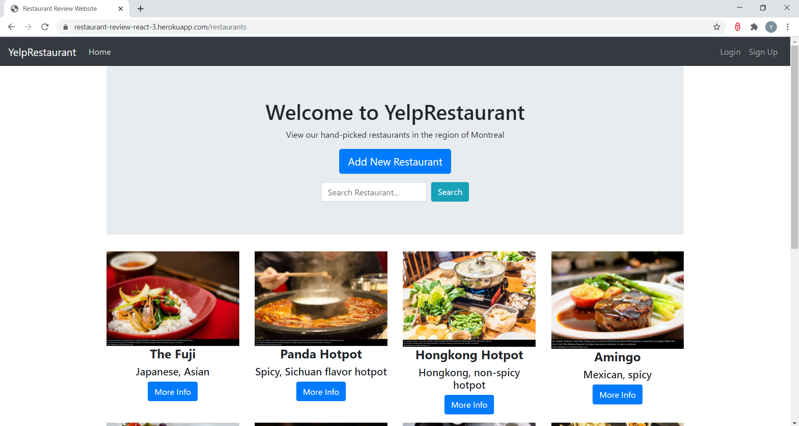
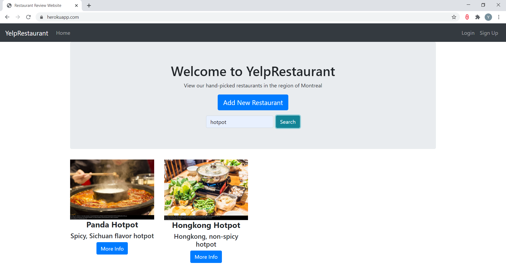
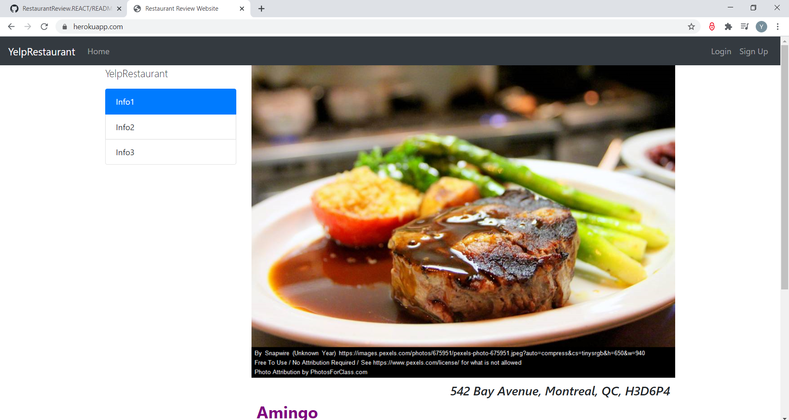
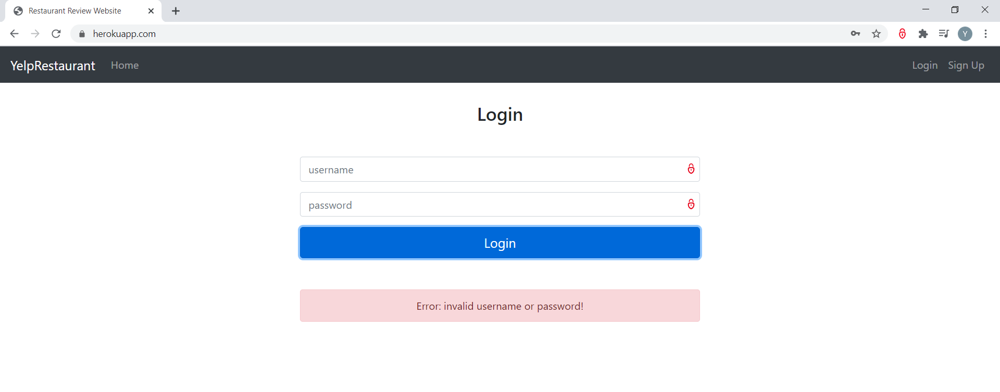
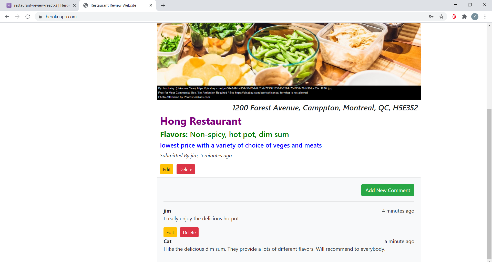
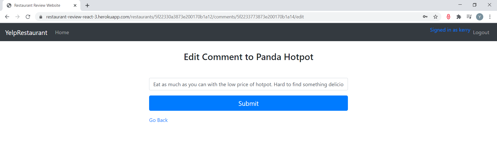

# Restaurant Review Website

<ul>
  <li> A RESTful style Web application that allows users to share their reviews of restaurants by uploading photos and comments and search for restaurants. </li>
  <li> Front-end was implemented with React using JavaScript, HTML, CSS and Bootstrap. </li>
  <li> Back-end was implemented with Node and Express, and utilized MongoDB for data management. </li>
  <li> User authentication and authorization was implemented by Passport. </li>
  <li> The web application has been deployed and supported on Heroku (https://restaurant-review-react-3.herokuapp.com/). </li>
  <li> The app was developed in goormIDE, a web-based cloud programming tool. </li>
</ul>

<h3>Landing Page </h3>

<h3> Home Page allows searching restaurant by keyword in restaurant name </h3>

<h3> Search result </h3>

<h3> Restaurant details </h3>

<h3> Adding new restaurant or new comment requires user login </h3>

<h3> Message shows whether user register or login is successful </h3>

<h3> Logged in user can create new restaurant and comment </h3>

<h3> Only author of the restaurant/comment or admin can see the edit/delete button of the corresponding restaurant/comment and do the editing/deleting </h3> 

<h3> Edit restaurant and comment </h3>

